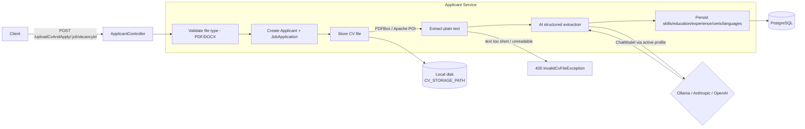

# AI-Powered Recruitment Platform

This repository demonstrates a recruitment platform built with **Spring Boot** and **Spring AI**, focused on solving a real-world hiring problem: manually reading every CV that comes in and typing its contents into a system is slow, repetitive, and inconsistent between reviewers.

The focus is on solving real-world production problems such as:

- Turning unstructured CVs (PDF / DOCX) into structured, queryable applicant data
- Avoiding vendor lock-in to a single AI provider
- Keeping the extraction step resilient to AI-provider failures and unreadable files

---

## The Problem

A typical "AI resume parser" hardcodes a single LLM provider directly into the business logic:

```java
// tightly coupled to one vendor
OpenAiApi openAi = new OpenAiApi(apiKey);
String result = openAi.chat(cvText);
```

That works, until the provider has an outage, raises prices, or you simply want to run everything locally with no API key at all during development. Rewriting the extraction logic every time you switch providers is a real, avoidable cost.

## The Solution — Provider-Agnostic AI Extraction

Instead of calling a specific vendor SDK, the application depends only on Spring AI's `ChatModel` abstraction. The active implementation — **Anthropic Claude**, **OpenAI**, or a **self-hosted Ollama** model — is selected entirely through a Spring profile, with each provider's model name and connection details isolated in its own `application-{profile}.yml`. No business logic changes when the provider changes.

---

## Overview

The platform is a single Spring Boot service exposing two resources:

- **Job Vacancies** — create, update, open/close, and paginated/filterable search over postings (title, required skills, minimum experience, degree, employment type, work model).
- **Applicants** — upload a CV against a vacancy; the platform stores the file, extracts its text, and uses the active LLM to populate the applicant's profile (contact details, skills, work experience, education, certificates, languages) automatically.

---

## 🏗️ Architecture Diagram



---

## 🔄 CV Upload & Extraction Flow

1. Client calls `POST /api/v1/applicants/uploadCvAndApply/{jobVacancyId}` with a PDF or DOCX file (multipart, 10MB max).
2. The file type is validated (PDF / DOCX only). An `Applicant` record is created with placeholder data and status `UPLOAD_RECEIVED`, the file is saved to disk, and a `JobApplication` links the applicant to the target vacancy with status `APPLIED`.
3. The stored file is loaded back and passed through `CvParserService`, which extracts plain text — PDFBox for PDF, Apache POI for DOCX.
4. If fewer than ~50 characters of readable text come back (a scanned/image-based CV, an unsupported layout), the request fails with `400 Bad Request` rather than silently producing an empty profile.
5. The extracted text is sent to `AiExtractionService`, which prompts the active `ChatModel` to return the applicant's data as structured JSON matching the applicant schema — skills, work experience, education, certificates, languages.
6. The AI's structured response is parsed and persisted against the applicant record; status moves to `EXTRACTION_DONE`.
7. The fully-populated applicant profile is returned to the client.

If the database write fails **after** the file has already been stored, the stored file is deleted as a compensating action rather than left orphaned on disk.

---

## AI Provider Selection

| Profile | Model | Requires |
|---|---|---|
| `ollama` (default) | `llama3.1:8b` | nothing — self-hosted, runs locally |
| `anthropic` | `claude-sonnet-4-5` | `ANTHROPIC_API_KEY` |
| `openai` | `gpt-4o-mini` | `OPENAI_API_KEY` |

Switch providers by setting `SPRING_PROFILES_ACTIVE` — no code or business-logic changes required.

---

## Tech Stack

- Java 21
- Spring Boot 4
- Spring AI 2.0 (Anthropic / OpenAI / Ollama)
- Spring Data JPA
- PostgreSQL
- Apache PDFBox / Apache POI (CV text extraction)
- MapStruct, Lombok
- Docker & Docker Compose
- JUnit 5, Testcontainers

---

## Project Structure

```text
recruitment-platform/
├── README.md
├── Dockerfile
├── docker-compose.yml
├── pom.xml
└── src/
    ├── main/java/com/recruitment/platform/
    │   ├── controller/       # ApplicantController, JobVacancyController
    │   ├── service/           # business logic + service/ai (provider strategies)
    │   ├── model/             # entity / dto / enums / payload (request, response)
    │   ├── mapper/             # MapStruct mappers
    │   ├── repository/        # Spring Data JPA repositories
    │   ├── storage/            # CV file storage
    │   └── exception/          # custom exceptions + GlobalExceptionHandler
    ├── main/resources/
    │   ├── application.yml
    │   ├── application-ollama.yml
    │   ├── application-anthropic.yml
    │   └── application-openai.yml
    └── test/
```

---

## 🚀 Running the Project

### Prerequisites

| Tool | Purpose |
|---|---|
| Docker Engine 24+ | Run the containers |
| Docker Compose v2 | Orchestrate app + Postgres + Ollama |
| ~6GB free disk | Default Ollama model (`llama3.1:8b`) is ~4.7GB |

### 1. Clone and start

```bash
git clone https://github.com/msedky/recruitment-platform-with-ai.git
cd recruitment-platform-with-ai
docker compose up --build -d
```

This starts four containers: PostgreSQL, Ollama, a one-shot job that pulls `llama3.1:8b` into Ollama, and the app itself.

> ⚠️ **First run takes several minutes** — Ollama has to download the model (~4.7GB) before the app is considered ready. Subsequent runs are fast; the model is cached in the `ollama-data` volume.

### 2. Verify it's up

```bash
curl http://localhost:8080/actuator/health
```

The app listens on `http://localhost:8080`.

### 3. (Optional) Switch AI provider

```bash
export SPRING_PROFILES_ACTIVE=anthropic
export ANTHROPIC_API_KEY=sk-ant-...
docker compose up --build
```

(or `openai` / `OPENAI_API_KEY`). The `ollama` containers still start alongside it; to skip them entirely when using a paid provider:

```bash
docker compose up --build postgres app
```

### 4. Stop / remove

```bash
docker compose down        # stop, keep volumes (DB data, model, uploaded CVs)
docker compose down -v     # stop and wipe everything
```

---

## Environment Variables

| Variable | Default | Notes |
|---|---|---|
| `SPRING_PROFILES_ACTIVE` | `ollama` | `ollama`, `anthropic`, or `openai` |
| `DB_URL` / `DB_USERNAME` / `DB_PASSWORD` | set by compose | PostgreSQL connection |
| `OLLAMA_BASE_URL` / `OLLAMA_MODEL` | `http://ollama:11434` / `llama3.1:8b` | `ollama` profile only |
| `ANTHROPIC_API_KEY` | — | required on `anthropic` profile |
| `OPENAI_API_KEY` | — | required on `openai` profile |
| `CV_STORAGE_PATH` | `/app/uploads/cvs` | where uploaded CVs are stored (volume-backed) |
| `PORT` | `8080` | app port |
| `JPA_DDL_AUTO` | `create-drop` | see Known Simplifications below |

---

## Service URL

```text
http://localhost:8080
```

---

## API Endpoints

### Job Vacancy Endpoints

Create Vacancy

```http
POST /api/v1/job-vacancies
```

Update Vacancy

```http
PUT /api/v1/job-vacancies/{id}
```

Get Vacancy By Id

```http
GET /api/v1/job-vacancies/{id}
```

Get All Vacancies (paginated, optional status filter)

```http
GET /api/v1/job-vacancies?status=OPENED&page=0&size=20
```

Open Vacancy

```http
PATCH /api/v1/job-vacancies/{id}/open
```

Close Vacancy

```http
PATCH /api/v1/job-vacancies/{id}/close
```

Delete Vacancy

```http
DELETE /api/v1/job-vacancies/{id}
```

### Applicant Endpoints

Upload CV & Apply

```http
POST /api/v1/applicants/uploadCvAndApply/{jobVacancyId}
```

Get Applicant By Id

```http
GET /api/v1/applicants/{id}
```

Get All Applicants

```http
GET /api/v1/applicants
```

Update Basic Info / Skills / Work Experiences / Educations / Certificates / Languages

```http
PUT /api/v1/applicants/{id}
PUT /api/v1/applicants/{id}/skills
PUT /api/v1/applicants/{id}/work-experiences
PUT /api/v1/applicants/{id}/educations
PUT /api/v1/applicants/{id}/certificates
PUT /api/v1/applicants/{id}/languages
```

Delete Applicant

```http
DELETE /api/v1/applicants/{id}
```

---

## 🧪 Curl Samples

#### Create Job Vacancy

```bash
curl --location 'http://localhost:8080/api/v1/job-vacancies' \
--header 'Content-Type: application/json' \
--data '{
    "title": "Senior Java Backend Developer",
    "description": "Own backend services for the recruitment platform.",
    "department": "Engineering",
    "location": "Cairo, Egypt",
    "employmentType": "FULL_TIME",
    "workModel": "REMOTE",
    "minExperienceYears": 5,
    "requiredDegreeType": "BACHELOR",
    "requiredSkills": [
        { "name": "Java", "minimumLevel": "EXPERT" },
        { "name": "Spring Boot", "minimumLevel": "EXPERT" }
    ]
}'
```

#### Open Vacancy

```bash
curl --location --request PATCH \
'http://localhost:8080/api/v1/job-vacancies/{jobVacancyId}/open'
```

#### Get All Vacancies (open only)

```bash
curl --location 'http://localhost:8080/api/v1/job-vacancies?status=OPENED&page=0&size=20'
```

#### Upload CV & Apply

```bash
curl --location 'http://localhost:8080/api/v1/applicants/uploadCvAndApply/{jobVacancyId}' \
--form 'file=@"/path/to/cv.pdf"'
```

#### Get Applicant By Id

```bash
curl --location 'http://localhost:8080/api/v1/applicants/{applicantId}'
```

---

## Testing

- Integration test (`ApplicantControllerIT`) covering the CV upload/apply flow against a Testcontainers-backed PostgreSQL instance, with a dedicated `application-test.yml` profile.

---

## ⚠️ Known Simplifications

This project intentionally simplifies certain concerns to stay focused on the AI-extraction pipeline:

- **CV parsing is text-based.** Scanned/image-only PDFs are not OCR'd — the platform rejects them with a clear error rather than silently returning an empty profile.
- **`JPA_DDL_AUTO` defaults to `create-drop`**, which recreates the schema on every app start/stop. This is intentional for a quick, self-contained demo; set `JPA_DDL_AUTO=update` (or introduce a migration tool) if you need data to persist across app restarts.
- **No authentication/authorization layer yet** — all endpoints are open. Not a concern for a local demo, but a real deployment would need it.

---

## ❓ Why This Project Matters

CV screening is one of the most repetitive parts of hiring, and one of the easiest to get wrong when done manually at volume. This project demonstrates:

- turning unstructured documents (PDF/DOCX) into structured, queryable data using an LLM
- a provider-agnostic AI integration — swap Anthropic, OpenAI, or a self-hosted model with a config change, not a code change
- resilient file handling — compensating cleanup on failure, rejection of unreadable input before it reaches the AI call
- a clean separation between document parsing, AI extraction, and persistence, each independently testable and replaceable
